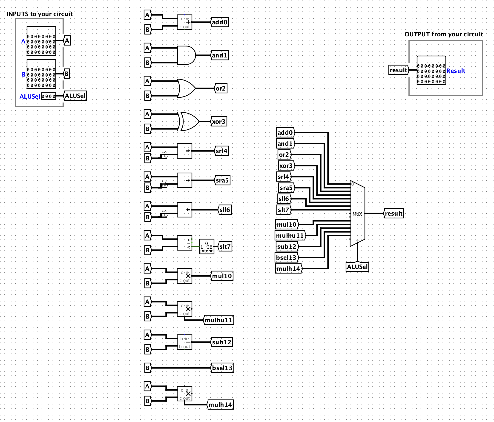
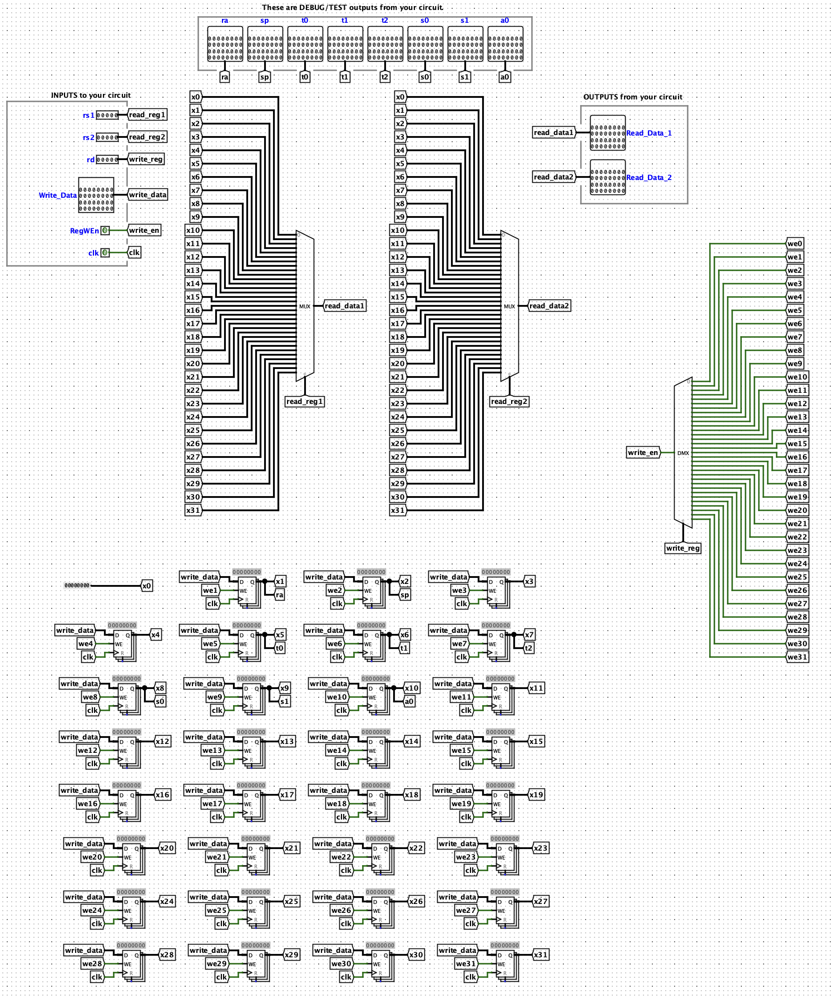
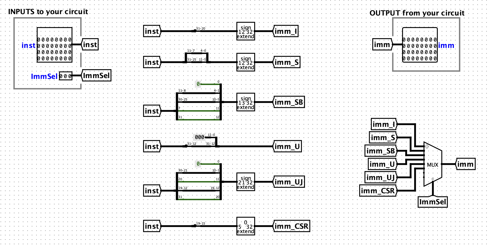
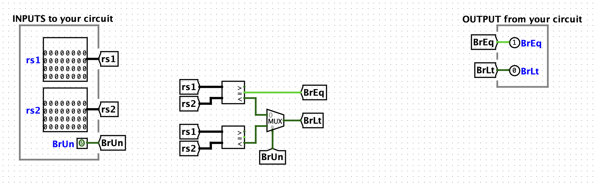
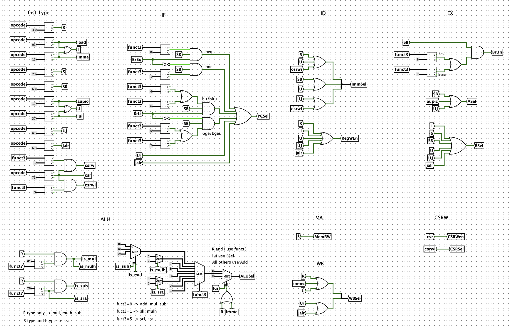
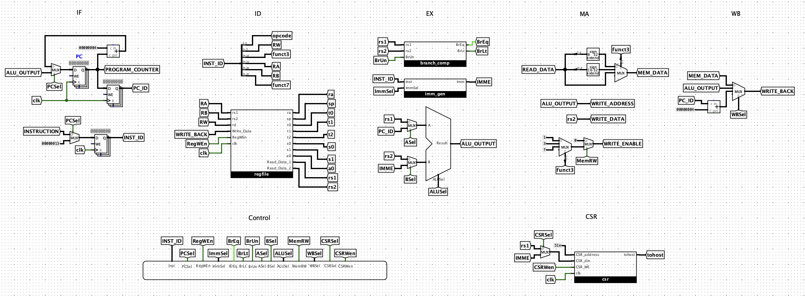

# CS61CPU

Project document: https://inst.eecs.berkeley.edu/~cs61c/fa20/projects/proj3/

## ALU Design

## Register File Design

## Immediate Generator Design

## Branch Comparator Design

## Control Logic Design

I use combinational logic to implement the control logic. Here is the control signal table. 

|        | R Type | I Type         | S Type | SB Type | U Type          | UJ Type |      |      |       |
| ------ | ------ | -------------- | ------ | ------- | --------------- | ------- | ---- | ---- | ----- |
|        |        | load & imme    |        |         | aupic & lui     |         | jalr | csrw | csrwi |
| PCSel  |        |                |        | D       |                 | 1       | 1    |      |       |
| RegWEn | 1      | 1              |        |         | 1               | 1       | 1    |      |       |
| ImmSel |        | 0              | 1      | 2       | 3               | 4       | 0    |      | 5     |
| BrUn   |        |                |        | D       |                 |         |      |      |       |
| ASel   |        |                |        | 1       | aupic 1         | 1       |      |      |       |
| BSel   |        | 1              | 1      | 1       | 1               | 1       | 1    |      |       |
| ALUSel | D      | load 0, imme D | 0      | 0       | lui 0, aupic 13 | 0       | 0    |      |       |
| MemRW  |        |                | 1      |         |                 |         |      |      |       |
| WBSel  | 1      | load 0, imme 1 |        |         | 1               | 2       | 2    |      |       |
| CSRSel |        |                |        |         |                 |         |      |      | 1     |
| CSRWen |        |                |        |         |                 |         |      | 1    | 1     |

- PCSel = 0 for PC + 4 , 1 for ALU
- BrUn = 0 for signed, 1 for unsigned
- ASel = 0 for rs1, 1 for PC
- BSel = 0 for rs2, 1 for immediate
- MemRW = 0 for read, 1 for write
- WBSel = 0 for memory data, 1 for ALU output, 2 for PC + 4

### PCSel: Branch

|      | BrEq | BrLt | PCSel |
| ---- | ---- | ---- | ----- |
| beq  | 1    |      | 1     |
| bne  | 0    |      | 1     |
| blt  |      | 1    | 1     |
| bge  |      | 0    | 1     |
| bltu |      | 1    | 1     |
| Bleu |      | 0    | 1     |

### ALUSel

| Operations | ALUSel | funct3 | Funct7 | Inst Type | f3 conflict |
| ---------- | ------ | ------ | ------ | --------- | ----------- |
| add        | 0      | 0      | 0      | R and I   | Y           |
| and        | 1      | 7      | 0      | R and I   |             |
| or         | 2      | 6      | 0      | R and I   |             |
| xor        | 3      | 4      | 0      | R and I   |             |
| srl        | 4      | 5      | 0      | R and I   | Y           |
| sra        | 5      | 5      | 20     | R and I   | Y           |
| sll        | 6      | 1      | 0      | R and I   | Y           |
| slt        | 7      | 2      | 0      | R and I   |             |
|            | 8      |        |        |           |             |
|            | 9      |        |        |           |             |
| mul        | A      | 0      | 1      | R         | Y           |
| mulhu      | B      | 3      | 1      | R         |             |
| sub        | C      | 0      | 20     | R         | Y           |
| bsel       | D      | lui    |        | R         |             |
| mulh       | E      | 1      | 1      | R         | Y           |
|            | F      |        |        |           |             |

- funct3 = 0 for add, mul and sub
- funct3 = 1 for sll and mulh
- funct3 = 5 for srl and sra

## CPU Desing

